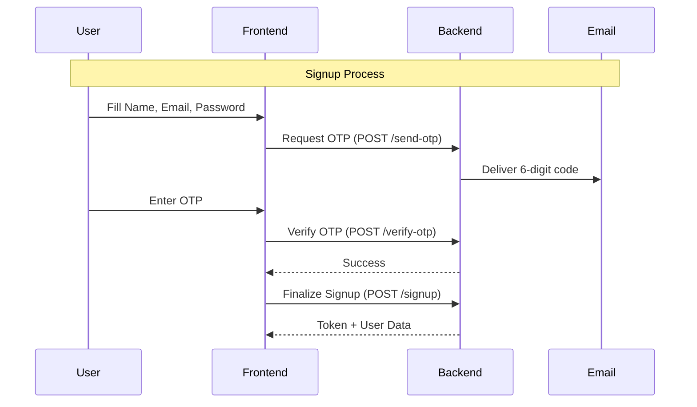
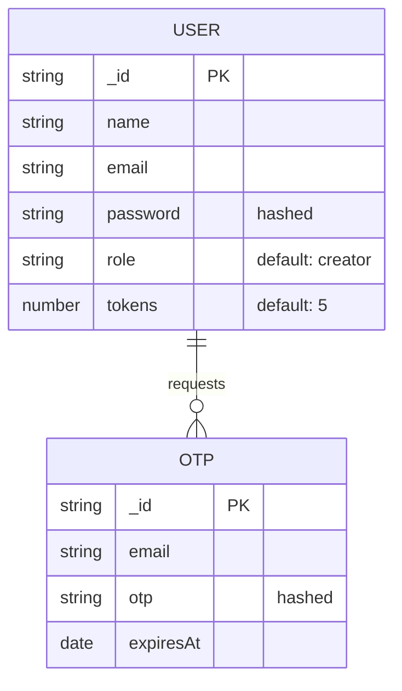
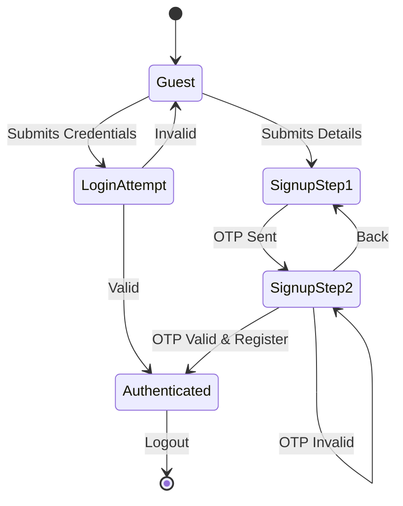
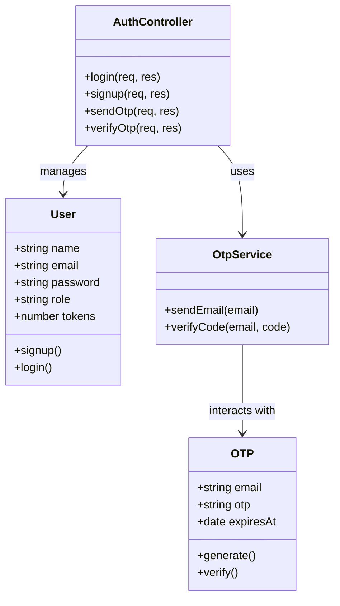

# CreatorConnect

A minimalist, high-performance platform for creators and developers. This project features a strictly black-and-white aesthetic with a focus on core functionality and secure authentication.

## 1. Project Overview

CreatorConnect is split into two main components:

- **Backend**: An Express.js server providing a RESTful API with JWT-based sessions and MongoDB storage.
- **Frontend**: A React + Vite SPA (Single Page Application) that manages user sessions via Context API and enforces route security.

---

## 2. Getting Started

Follow these steps to get the project running locally.

### Prerequisites

- Node.js (v18 or higher)
- MongoDB (Local instance or Atlas URI)
- Gmail account (for OTP delivery via App Passwords)

### Step 1: Clone and Install

```bash
git clone https://github.com/Vibhav-y/Creator_Connect.git
cd creator-connect

# Install Backend dependencies
cd backend
npm install

# Install Frontend dependencies
cd ../frontend
npm install
```

### Step 2: Configure Environment Variables

Create a `.env` file in both the `/backend` and `/frontend` directories.

**Backend (.env)**

```env
PORT=5000
MONGO_URI=mongodb+srv://... (Your MongoDB URI)
JWT_SECRET=your_secure_random_string
EMAIL_USER=vibhav55y@gmail.com
EMAIL_PASS=gjmlkdqwqgttgxtg (Gmail App Password)
```

**Frontend (.env)**

```env
VITE_API_BASE_URL=http://localhost:5000
```

### Step 3: Run the Application

Open two terminal windows/tabs:

**Terminal 1 (Backend)**

```bash
cd backend
npm run dev
```

**Terminal 2 (Frontend)**

```bash
cd frontend
npm run dev
```

The app will be available at `http://localhost:5173`.

---

## 3. Architecture & Flows

### Authentication Flow (Sequence Diagram)



### Database Schema (ER Diagram)



### User Authentication Activity (UML Activity Diagram)



### System Architecture (UML Class Diagram)



---

## 4. Backend API Reference

| Mode   | Method | Endpoint               | Description                |
| :----- | :----- | :--------------------- | :------------------------- |
| PUBLIC | POST   | `/api/auth/login`      | Login and receive JWT.     |
| PUBLIC | POST   | `/api/auth/send-otp`   | Trigger OTP email.         |
| PUBLIC | POST   | `/api/auth/verify-otp` | Validate user's code.      |
| PUBLIC | POST   | `/api/auth/signup`     | Complete registration.     |
| SECURE | GET    | `/api/auth/me`         | Fetch active user session. |
| SECURE | POST   | `/api/auth/logout`     | End active session.        |

_Note: All "SECURE" routes require `Authorization: Bearer <token>`._

---

## 5. Frontend Architecture

### State Management

We use the **Context API** (`UserContext.jsx`) to handle global state:

- **`user`**: Stores current user object or `null`.
- **`loading`**: Boolean flag to prevent UI flickers during session recovery.
- **`login/logout/signup`**: Encapsulated API logic.

### Route Protection

Route gating is handled in `App.jsx` using two wrapper components:

- **`ProtectedRoute`**: Only allows authenticated users. Redirects guests to `/login`.
- **`PublicRoute`**: Only allows guests. Redirects logged-in users back to `/`.

### Theme Management

The application features a built-in theme engine (`ThemeContext.jsx`) for switching between **Light** and **Dark** modes:

- **Persistence**: Remembers your preference using `localStorage`.
- **Implementation**: Toggles a `.dark-theme` class on the `body` element.
- **Visuals**: Swaps CSS variables for `--bg-main` and `--text-main` while keeping the flat, monochrome aesthetic.

---

## 6. Styling Philosophy

The project uses **Vanilla CSS** with a strict monochrome constraint:

- **Colors**: Only `#000000`, `#ffffff`, and `#888888`.
- **Typography**: Monospace fonts (`Courier New`) for a technical, flat aesthetic.
- **Layout**: Simple borders and zero shadows or gradients.
